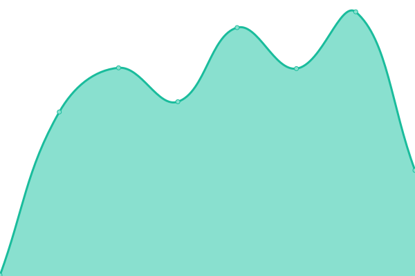

# [📈 Live Status](https://status.sereno.one): <!--live status--> **🟧 Partial outage**

This repository contains the open-source uptime monitor and status page for [Sereno](https://status.sereno.one), powered by [Upptime](https://github.com/upptime/upptime).

With [Upptime](https://upptime.js.org), you can get your own unlimited and free uptime monitor and status page, powered entirely by a GitHub repository. We use [Issues](https://github.com/serenov7/status.sereno.one/issues) as incident reports, [Actions](https://github.com/serenov7/status.sereno.one/actions) as uptime monitors, and [Pages](https://status.sereno.one) for the status page.

<!--start: status pages-->
<!-- This summary is generated by Upptime (https://github.com/upptime/upptime) -->
<!-- Do not edit this manually, your changes will be overwritten -->
<!-- prettier-ignore -->
| URL | Status | History | Response Time | Uptime |
| --- | ------ | ------- | ------------- | ------ |
|  [Drive](https://drive.sereno.one) | 🟩 Up | [drive.yml](https://github.com/SerenoV7/status.sereno.one/commits/HEAD/history/drive.yml) | 

 1793ms
     
 | 

<a href="https://status.sereno.one/history/drive">95.74%</a>
    

|  [GitLab](https://git.sereno.one) | 🟩 Up | [git-lab.yml](https://github.com/SerenoV7/status.sereno.one/commits/HEAD/history/git-lab.yml) | 

 1286ms
     
 | 

<a href="https://status.sereno.one/history/git-lab">97.40%</a>
    

|  [OpenWebUI](https://ai.sereno.one) | 🟩 Up | [open-web-ui.yml](https://github.com/SerenoV7/status.sereno.one/commits/HEAD/history/open-web-ui.yml) | 

 2247ms
     
 | 

<a href="https://status.sereno.one/history/open-web-ui">29.85%</a>
    

|  [Portfolio](https://sereno.one) | 🟥 Down | [portfolio.yml](https://github.com/SerenoV7/status.sereno.one/commits/HEAD/history/portfolio.yml) | 

 108ms
     
 | 

<a href="https://status.sereno.one/history/portfolio">22.87%</a>
    

|  [CDN](https://cdn.sereno.one/i/morch.png) | 🟩 Up | [cdn.yml](https://github.com/SerenoV7/status.sereno.one/commits/HEAD/history/cdn.yml) | 

 355ms
     
 | 

<a href="https://status.sereno.one/history/cdn">100.00%</a>
    

<!--end: status pages-->

[**Visit our status website →**](https://status.sereno.one)

## 📄 License

- Powered by: [Upptime](https://github.com/upptime/upptime)
- Code: [MIT](./LICENSE) © [Anand Chowdhary](https://anandchowdhary.com), supported by [Pabio](https://pabio.com)
- Data in the `./history` directory: [Open Database License](https://opendatacommons.org/licenses/odbl/1-0/)
